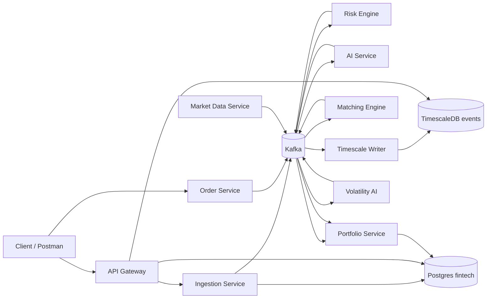
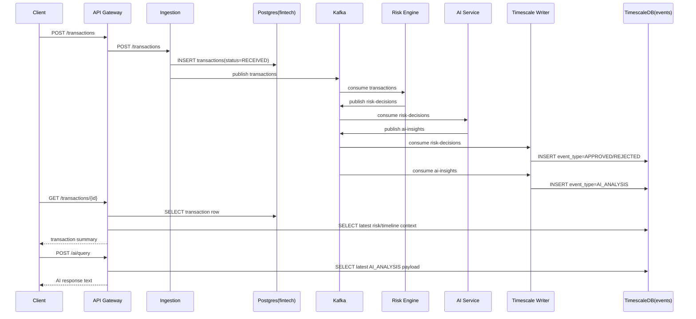
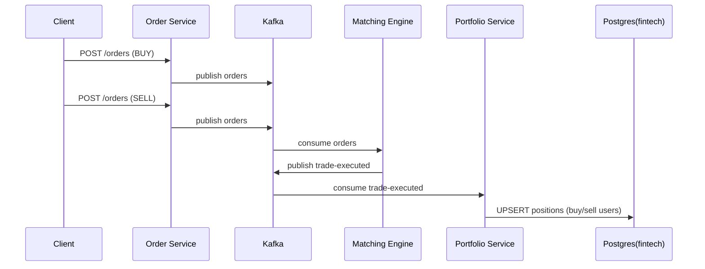
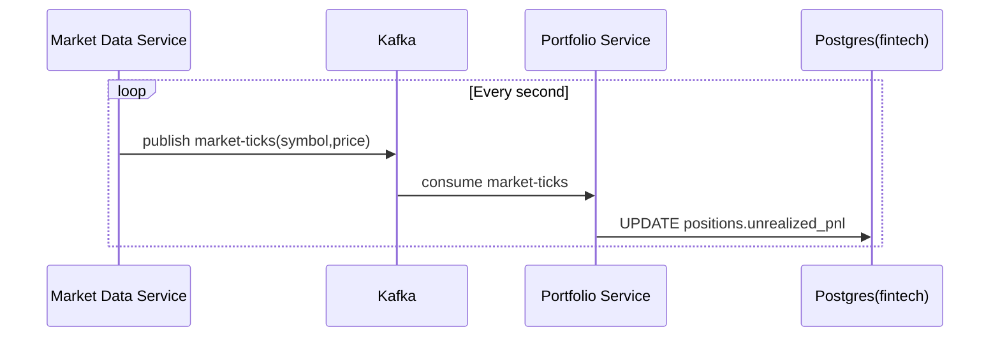
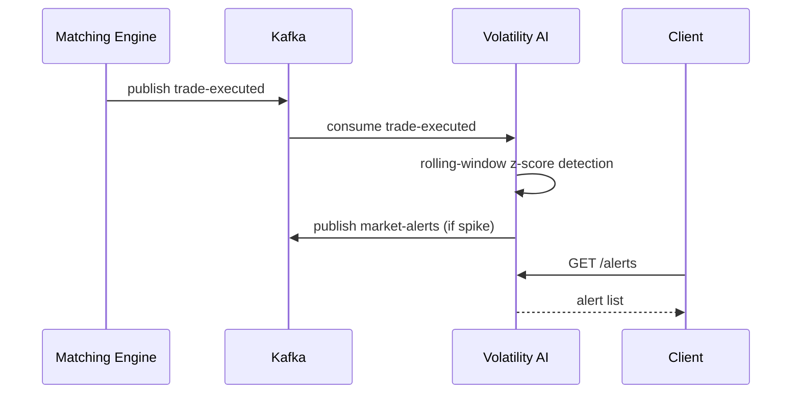

# Architecture Deep Dive

This document provides detailed architecture, sequence flows, and payload-level contracts for the Fin Intel Platform.

## 1) System Context

The platform is an event-driven microservices system.

- Synchronous edge: HTTP (`api-gateway`, `ingestion`, `order-service`, `matching-engine`, `volatility-ai`)
- Asynchronous backbone: Kafka topics
- Operational state: Postgres (`fintech`)
- Event timeline/history: TimescaleDB (`events`) via `transaction_events` hypertable

## 2) Service Interaction Map



## 3) Kafka Topics and Ownership

| Topic | Producers | Consumers | Purpose |
|---|---|---|---|
| `transactions` | ingestion | risk-engine | canonical transaction intake |
| `transactions-retry` | risk-engine | risk-engine | retry lane for transient failures |
| `transactions-dlq` | risk-engine, ingestion fallback | ops/manual | dead-letter storage |
| `risk-decisions` | risk-engine | ai-service, timescale-writer, market-data-service | risk decision stream (non-APPROVED rebroadcast as WS `risk-rejections`) |
| `ai-insights` | ai-service | timescale-writer | AI analysis output |
| `orders` | order-service | matching-engine | order creation events |
| `order-cancel` | order-service | matching-engine | order cancellation events |
| `trade-executed` | matching-engine | portfolio-service, volatility-ai | execution stream |
| `orderbook-snapshots` | matching-engine | market-data-service | normalized order book snapshots |
| `orderbook-deltas` | matching-engine | market-data-service | incremental top-of-book updates |
| `market-ticks` | market-data-service | portfolio-service | mark-to-market updates |
| `market-alerts` | volatility-ai | market-data-service, downstream/ops | volatility alert stream |

## 4) Sequence Diagrams

### 4.1 Transaction -> Risk -> AI -> Timeline



### 4.2 Order -> Match -> Trade -> Portfolio



### 4.3 Market Data -> Unrealized PnL



### 4.4 Trade -> Volatility Alerts



## 5) Payload Contracts (Examples)

### 5.1 `transactions`
```json
{
  "version": "v1",
  "event_id": "b69498d3-440c-49cf-b5e5-67e9bbeb5706",
  "user_id": "user-101",
  "amount": 9200.75,
  "currency": "USD",
  "occurred_at": "2026-02-27T09:30:07Z",
  "source": "api"
}
```

### 5.2 `risk-decisions`
```json
{
  "transaction_id": "b69498d3-440c-49cf-b5e5-67e9bbeb5706",
  "risk_score": 0,
  "decision": "APPROVED"
}
```

### 5.3 `ai-insights`
```json
{
  "event_id": "f7c74a12-822f-42f0-9c71-71df0c98ecad",
  "transaction_id": "b69498d3-440c-49cf-b5e5-67e9bbeb5706",
  "verdict": "Low Risk",
  "confidence": 0.455,
  "reasoning": [
    "Rule-based risk weighted",
    "Behavioral anomaly applied",
    "Velocity anomaly applied",
    "Geo probability applied"
  ],
  "created_at": 1772189061
}
```

### 5.4 `orders`
```json
{
  "event_id": "evt-123",
  "order_id": "ord-buy-1",
  "user_id": "user-buy-1",
  "symbol": "INFY",
  "side": "BUY",
  "type": "LIMIT",
  "price": 1500,
  "quantity": 5,
  "created_at": 1772189000
}
```

### 5.5 `trade-executed`
```json
{
  "trade_id": "856950ab-ca23-43e6-a598-52df3a2e4c30",
  "buy_order_id": "ord-buy-2",
  "sell_order_id": "ord-sell-2",
  "buy_user_id": "user-buy-2",
  "sell_user_id": "user-sell-2",
  "symbol": "INFY",
  "price": 1500,
  "quantity": 5,
  "timestamp": 1772184939
}
```

### 5.6 `market-ticks`
```json
{
  "symbol": "INFY",
  "price": 1012.45,
  "timestamp": 1772189100
}
```

### 5.7 `orderbook-snapshots`
```json
{
  "symbol": "INFY",
  "bids": [{"price": 1500, "quantity": 8}],
  "asks": [{"price": 1501, "quantity": 5}],
  "spread": 1
}
```

### 5.8 `orderbook-deltas`
```json
{
  "symbol": "INFY",
  "bids": [{"price": 1500, "quantity": 10}],
  "asks": [{"price": 1501, "quantity": 0}],
  "spread": 1,
  "timestamp": 1772201000
}
```

### 5.9 `market-alerts`
```json
{
  "symbol": "VOLTEST",
  "type": "VOLATILITY_SPIKE",
  "z_score": 5.38,
  "volatility": 0.42,
  "timestamp": 1772185465
}
```

### 5.10 `risk-rejections` (WS topic)
```json
{
  "transaction_id": "risk-ws-2",
  "risk_score": 95,
  "decision": "BLOCKED"
}
```

## 6) WebSocket Contract (`market-data-service`)

Endpoint:
- `ws://localhost:8070/ws/market`

Optional subscription filters:
- `symbols=INFY,TCS`
- `topics=market-ticks,trade-executed,orderbook-snapshots,orderbook-deltas,market-alerts,risk-rejections`

Envelope:
```json
{
  "topic": "orderbook-deltas",
  "payload": {
    "symbol": "INFY",
    "bids": [{"price": 1500, "quantity": 10}],
    "asks": [],
    "spread": 0,
    "timestamp": 1772201000
  }
}
```

## 7) Storage Model Details

### 7.1 Operational DB (`fintech`)

- `transactions`: source-of-truth for API-submitted transactions.
- `positions`: consolidated holdings/PnL state.
- `market_prices`: currently available for symbol-level price snapshots.

### 7.2 Timeline DB (`events`)

- `transaction_events` is append-only event history for investigative/read APIs.
- `payload` keeps original JSON for traceability and future reprocessing.
- `event_type` is normalized for efficient filtering (`APPROVED`, `AI_ANALYSIS`, etc.).

## 8) Internal Service Mechanics

### 8.1 Failure handling

- Ingestion producer retries and attempts DLQ on repeated failure.
- Risk engine retries via `transactions-retry` and dead-letters poison records.

### 8.2 Idempotency and consistency

- Order service uses idempotency repository to reject duplicate `order_id`.
- Portfolio updates are upsert-based to keep state convergent.

### 8.3 Read-path composition

`GET /transactions/{id}` composes from:
- Postgres: transaction amount/status
- Timescale: latest decision-derived context

`POST /ai/query` composes from:
- latest `AI_ANALYSIS` row in Timescale for `transaction_id`

### 8.4 AI provider pipeline

- `ai-service` always consumes `risk-decisions` and emits `ai-insights`.
- Runtime mode controls LLM usage:
  - `AI_MODE=deterministic`: feature-based analyzer only.
  - `AI_MODE=hybrid`: Gemini/OpenAI attempt first, deterministic fallback on errors.
  - `AI_MODE=llm_only`: Gemini/OpenAI required; processing error if unavailable.
- Provider selection:
  - `AI_PROVIDER=gemini` (default)
  - `AI_PROVIDER=openai`
- Gemini client contract:
  - request path: `/models/{model}:generateContent`
  - base URL defaults to `https://generativelanguage.googleapis.com/v1beta`
  - if operator provides only host/root URL, client normalizes to `/v1beta`

## 9) Monitoring and Runtime Notes

- Monitoring profile (`prometheus`, `grafana`, `kafka-exporter`) is optional.
- Kafka is sensitive to root-disk pressure; if disk fills:
  - broker exits,
  - producers fail (`no such host`, `unknown topic`, connection refused),
  - runbook: free disk -> restart kafka -> rerun kafka-init.

## 10) Known Constraints

- JWT verification is HS256/shared-secret based (no JWKS/OIDC integration yet).
- Tracing is trace-id propagation (not full OpenTelemetry spans/export pipeline yet).
- Matching engine persistence/replay is file-based snapshot restore (single-node oriented).
- Some services are event-only and intentionally expose no REST APIs.

## 11) Suggested Engineering Extensions

- Introduce external schema registry integration (Confluent/Apicurio) and compatibility policies.
- Upgrade tracing from header propagation to full OpenTelemetry traces and exporter backend.
- Move orderbook persistence from local file snapshots to durable DB/event-log replay.
- Add alert routing (Alertmanager/PagerDuty/Slack) for lag and broker health.
